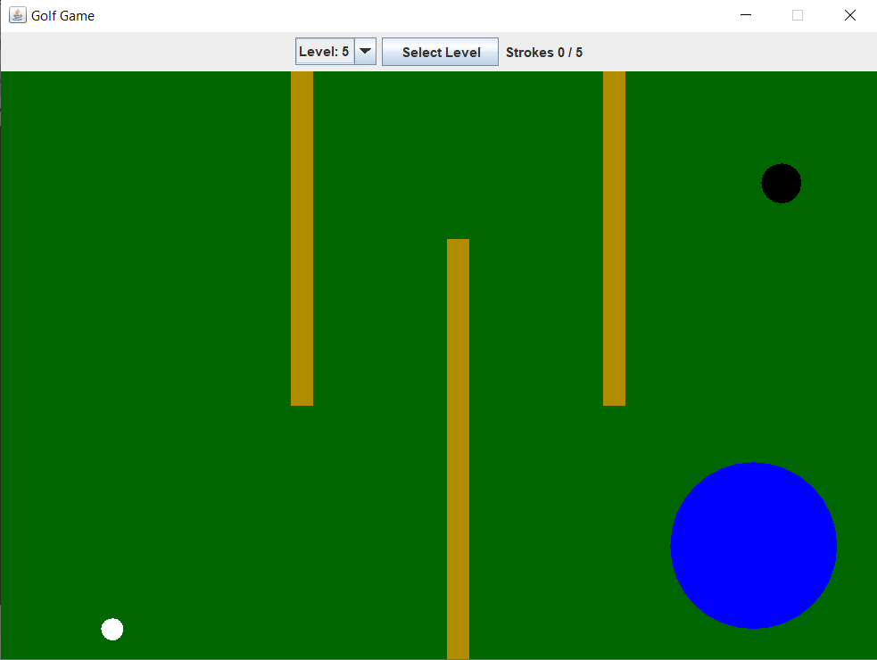

# MiniGolfGame2D

# ⛳ Mini Golf 2D

Mini Golf 2D is a fun, classic-style mini golf game developed in pure **Java Swing**.  
Drag & shoot mechanic, realistic(ish) ball physics, walls, water hazards (lakes) and multiple challenging levels.

  

## 🎯 Game Objective

Get the white golf ball into the black hole using as few strokes as possible.  
Each level has a **maximum stroke limit** — exceed it and you'll have to restart!

## 🎮 How to Play

- **Mouse drag** from ball → determines **direction** and **power**
- Release mouse to **shoot**
- Get ball into the **black hole**
- Try to stay under the **maximum stroke limit**
- **R** key → restart current level (when out of strokes)
- **SPACE** → next level (after completion)
- Level selector combo box at the top
## ✨Features

- Classic **drag & release** shooting mechanic (power & direction from drag distance & angle)
- Realistic friction & bounce physics (with slight energy loss)
- **Walls** — bounce off them (orange rectangles)
- **Water hazards (lakes)** — slow the ball down significantly when inside
- 6 progressively harder levels with different obstacle layouts
- Visual stroke counter & level selector

## 🛠️ Technology Stack

- Language: **Java** (JDK 8+ recommended)
- GUI Framework: **Java Swing** + **AWT** (Graphics2D rendering)
- Game loop: `javax.swing.Timer` (~60 FPS)
- Concepts used:
  - OOP (inheritance, abstraction, encapsulation)
  - Basic vector physics & collision detection
  - Mouse drag interaction
  - Simple state management

| Class Name    | Description / Main Responsibilities                                                                                                                                                                                                                                                             |
| ------------- | ----------------------------------------------------------------------------------------------------------------------------------------------------------------------------------------------------------------------------------------------------------------------------------------------- |
| **Golf**      | Entry point of the application. Creates and configures the main `JFrame` window, sets icon, size, layout and adds `GamePanel` + info panel (level selector + stroke counter).                                                                                                                   |
| **GamePanel** | **Core game engine** — Handles: • Game loop (Timer) • Mouse input (drag & shoot) • Rendering (ball, hole, obstacles, drag line, messages) • Collision detection • Level initialization & switching • Stroke counting & level completion logic • Key events (R to restart, SPACE for next level) |
| **Ball**      | Represents the golf ball. Manages: • Position (x, y) • Velocity (vx, vy) • Movement with friction • Collision detection with walls & lakes • Distance calculation to hole • Stopped state check                                                                                                 |
| **Hole**      | Represents the target hole. Stores: • Fixed position (x, y) • Constant radius (18 px) • Getter methods                                                                                                                                                                                          |
| **Obstacle**  | **Abstract base class** for all obstacles. Defines common properties: • Position (x, y) • Size (width, height) • Getters & setters                                                                                                                                                              |
| **Wall**      | Concrete subclass of `Obstacle`. Represents solid walls that the ball bounces off. No additional logic beyond the base class.                                                                                                                                                                   |
| **Lake**      | Concrete subclass of `Obstacle`. Represents water hazards that significantly slow down the ball when entered. No extra fields beyond the base class.                                                                                                                                            |

## 👥 Creator
- **Muhammed Tunç**

